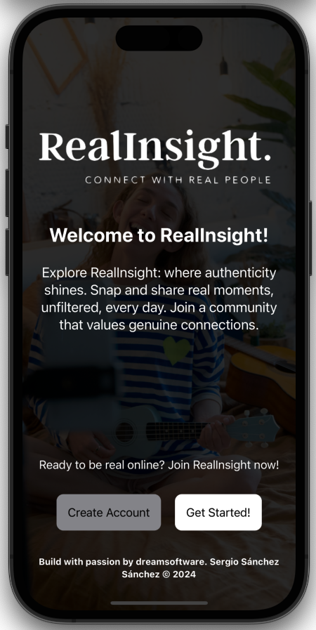
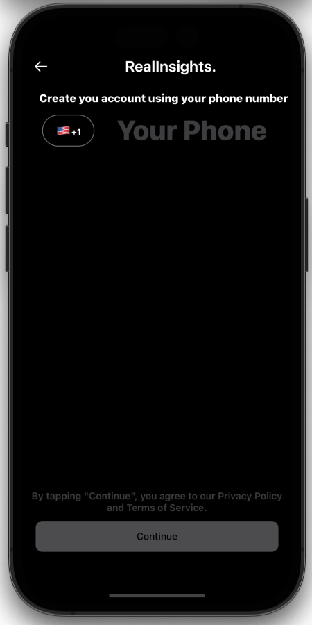
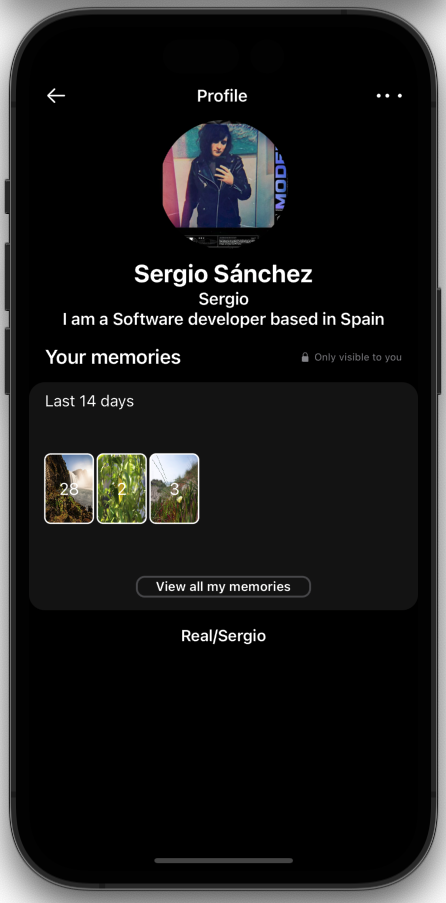

# RealInsight 🌟: Where Authentic Connections Happen 🌐

🌟 RealInsight is an innovative iOS application crafted using SwiftUI, designed to offer users an engaging platform akin to BeReal. With RealInsight, users are empowered to connect with one another and foster meaningful interactions by sharing their insights, thoughts, and experiences within a supportive community environment. 

Whether it's reflecting on personal growth journeys, sharing inspirational moments, or discussing thought-provoking topics, RealInsight provides a space where users can authentically express themselves and engage with a diverse community of like-minded individuals. Through its intuitive interface and robust feature set, RealInsight encourages users to explore, connect, and discover new perspectives, ultimately fostering a sense of belonging and camaraderie among its users. 🚀

  
  
  
  
  

## Features 🚀

- **User Authentication:** Secure sign-up and login functionality.
- **Profile Customization:** 🎨 Users can personalize their profiles with profile pictures, bios, and other details.
- **Post Creation:** ✍️ Create posts with text, images, or videos to share insights and experiences.
- **Feed:** 📰 Scroll through a feed of posts from other users to stay updated and engaged.
- **Interactions:** ❤️ Like, 💬 comment, and ↪️ share posts to interact with the community.
- **Search:** 🔍 Discover posts and users through a robust search feature.
- **Notifications:** 📲 Stay informed with real-time notifications for likes, comments, and follows.

## Why SwiftUI and MVVM? 🧐

RealInsight leverages SwiftUI for its user interface implementation due to several advantages it offers:

### Advantages of SwiftUI:

- **Declarative Syntax:** SwiftUI uses a declarative syntax, allowing developers to describe the UI and its behavior in a simple and intuitive way. This leads to faster development and easier maintenance.
- **Live Preview:** With SwiftUI's live preview feature in Xcode, developers can see real-time changes to the UI as they write code, making the design and development process more efficient.
- **Cross-Platform Compatibility:** SwiftUI is designed to work seamlessly across all Apple platforms, including iOS, macOS, watchOS, and tvOS. This allows for code reuse and a consistent user experience across devices.
- **Swift Integration:** Being native to Swift, SwiftUI integrates seamlessly with existing Swift codebases and libraries, making it easy to adopt for iOS projects.

### Clean architecture and MVVM pattern:

RealInsight is designed with a strong emphasis on clean architecture, leveraging the separation of concerns to enhance maintainability and scalability. Through the implementation of UseCases, Repositories, and DataSources, complex logic is encapsulated and decoupled from the rest of the architecture, allowing for flexibility in persistence solutions such as Firestore and Firebase authentication.

In addition to clean architecture, RealInsight adopts the **MVVM (Model-View-ViewModel) architectural pattern.** This structure delineates the application into distinct layers:

* **Model:** Houses the data structures and business logic, ensuring data integrity and consistency.
* **View:** Represents the user interface elements, responsible for displaying information to the user.
* **ViewModel:** Acts as a liaison between the View and the Model, handling data manipulation and presentation logic. It fetches data from the Model and prepares it for display in the View.

By employing MVVM with SwiftUI, RealInsight achieves a modern, efficient, and scalable architecture. This approach enhances development productivity, facilitates code maintenance, and fosters codebase modularity and testability. Ultimately, RealInsight delivers a seamless and immersive user experience while upholding robust architectural principles.

## Getting Started 🏁

To get started with RealInsight, follow these steps:

1. **Clone the Repository:** `git clone https://github.com/sergio11/real_insight_swiftui.git`
2. **Open in Xcode:** 🖥️ Navigate to the cloned directory and open the project in Xcode.
3. **Build and Run:** 🏗️ Build the project and run it on a simulator or physical device.

## Requirements 🛠️

- iOS 14.0+
- Xcode 12.0+
- Swift 5.3+

## App Screenshots

Here are some screenshots from our app to give you a glimpse of its design and functionality.

 

 

 

 

 

 

 

 

 

## Contributing 🤝

Contributions are welcome! If you'd like to contribute to RealInsight, please fork the repository and create a pull request with your changes.

## Support 💬

For support, bug reports, or feature requests, please open an issue on the GitHub repository.

## License 📄

RealInsight is available under the MIT License. See the [LICENSE](LICENSE) file for more information.

## Acknowledgements 🙏

RealInsight is inspired by the functionality and design of BeReal.

## Please Share & Star the repository to keep me motivated.

Template mockup from https://previewed.app/template/AFC0B4CB
